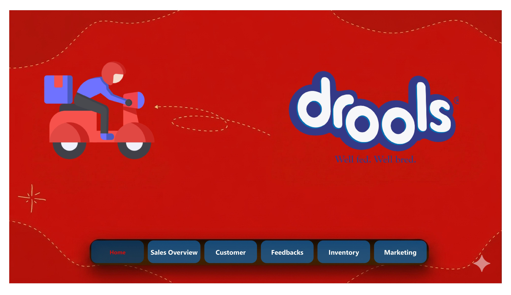
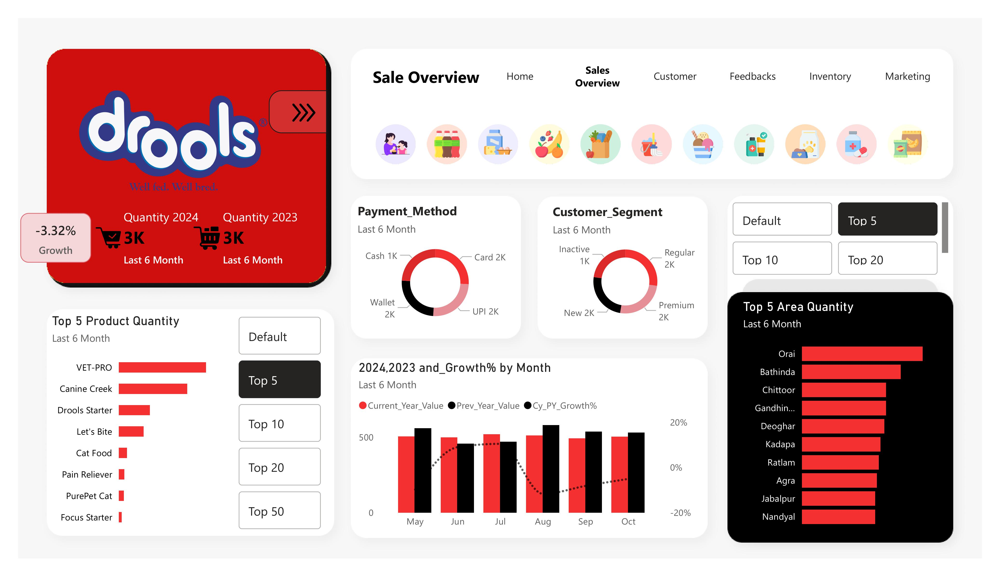
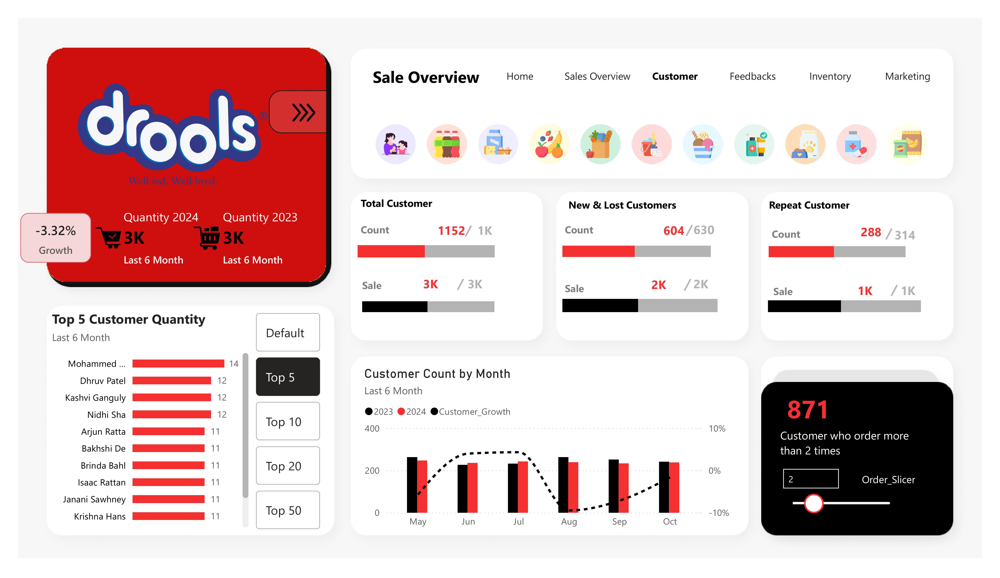
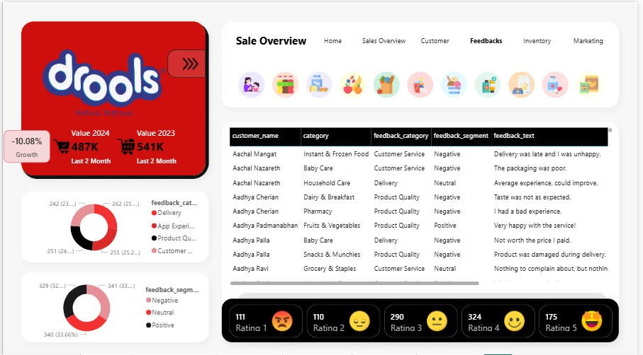
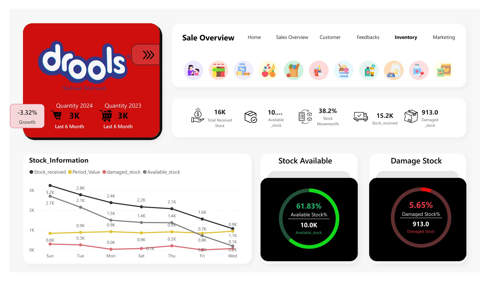
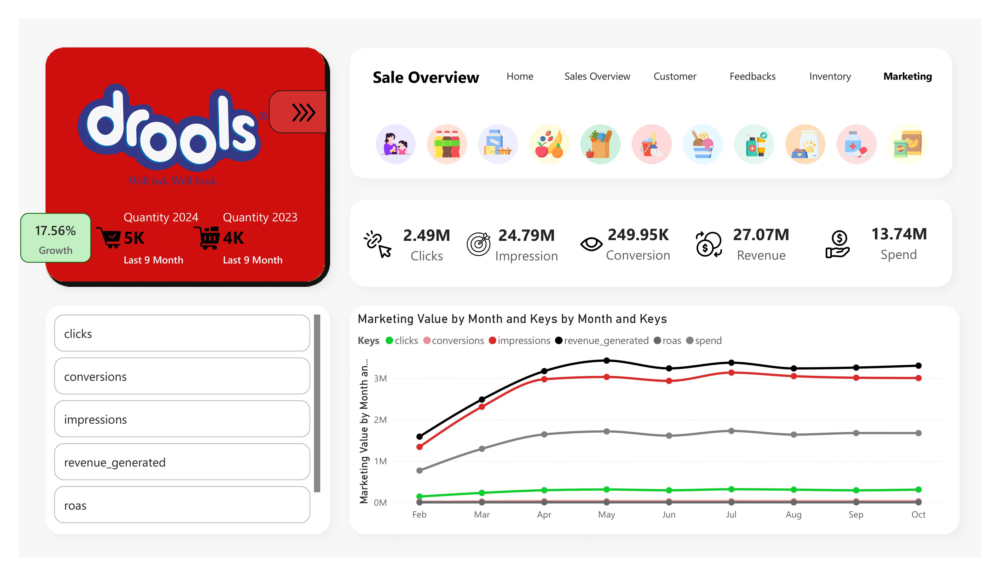

# Drools Power BI Dashboard

## Project Overview
This project is an interactive Power BI dashboard developed for analyzing sales, customers, inventory, feedback, and marketing performance for a quick-commerce business.

The dashboard helps businesses track KPIs, monitor growth, identify trends, and improve decision-making through interactive visualizations.

---

## Dashboard Pages

### 1. Sales Overview
- Sales trends analysis
- Top products and top regions
- Growth comparison
- Customer segmentation

### 2. Customer Analysis
- Repeat customer analysis
- New & lost customer tracking
- Customer growth trends

### 3. Feedback Analysis
- Customer ratings analysis
- Sentiment tracking
- Feedback category analysis

### 4. Inventory Dashboard
- Available stock monitoring
- Damaged stock analysis
- Stock movement tracking

### 5. Marketing Dashboard
- Clicks & conversion tracking
- Revenue analysis
- Marketing performance monitoring

---

## Tools & Technologies Used
- Power BI
- DAX
- Power Query
- Excel
- Data Modeling

---

## Project Files
- Power BI Dashboard (.pbix)
- Dashboard Screenshots
- Project Documentation

---

## Dashboard Preview

### Home Dashboard

### Sales Overview

### Customer Dashboard

### Feedback Dashboard

### Inventory Dashboard

### Marketing Dashboard

---

## Author
Ajay
